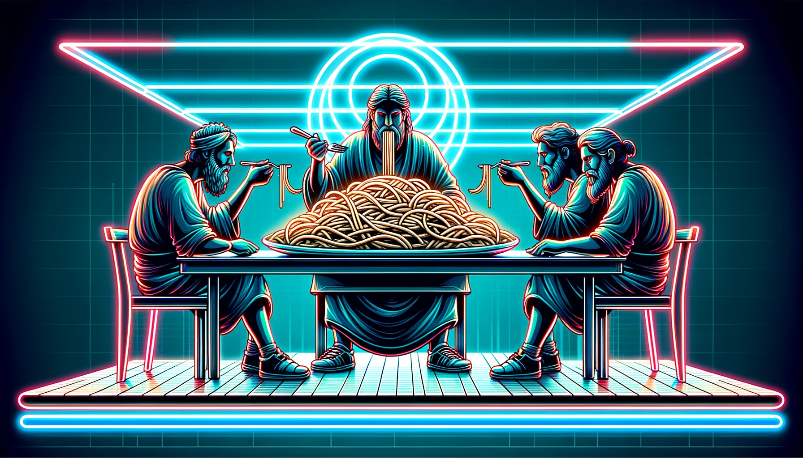
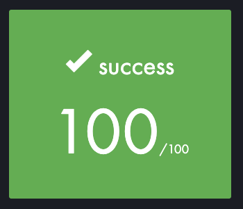

 

# PHILOSOPHERS
Ce programme implémente la simulation du problème classique des philosophes qui dînent en utilisant des threads et des mutex en langage C.

## Consignes :
> Cette simulation implique que les philosophes alternent entre manger, réfléchir et dormir. Ils utilisent des fourchettes pour manger et les remettent sur la table lorsqu'ils ont fini de manger. Les philosophes ne doivent jamais mourir de faim, et la simulation s'arrête lorsqu'un philosophe meurt de faim. Le programme doit être écrit sans utiliser de variables globales et doit prendre des arguments tels que le nombre de philosophes, les limites de temps pour manger, dormir et mourir, ainsi qu'un argument facultatif pour le nombre de repas que chaque philosophe doit prendre avant que la simulation ne s'arrête. Le programme doit également gérer l'enregistrement des événements et veiller à ce que les philosophes évitent de mourir. Le programme peut être implémenté soit avec des threads et des mutex, soit avec des processus et des sémaphores (dans mon cas, threads & mutex). 

 

---

### Initialisation des données :
Le programme prend des arguments en ligne de commande pour définir les paramètres du problème, tels que le nombre de philosophes, le temps pour manger, le temps pour dormir, etc.
Les données sont initialisées à l'aide de la fonction parse_input et stockées dans une structure t_table, qui représente la table à laquelle les philosophes dînent.

### Initialisation des philosophes et des fourchettes :
Les philosophes et les fourchettes sont initialisés à l'aide de la fonction data_init. Chaque philosophe est associé à deux fourchettes voisines sur la table.

### Lancement de la simulation :
La fonction dinner_start est appelée pour lancer la simulation.
Si le nombre de philosophes est égal à 1, un philosophe particulier est géré de manière isolée dans la fonction lone_philo. Sinon, chaque philosophe est géré dans la fonction dinner_simulation.
Un moniteur (dinner_monitor) est également créé pour surveiller l'état des philosophes.

### Boucle de simulation :
Chaque philosophe commence par penser (thinking), puis tente de prendre deux fourchettes adjacentes pour manger (eat).
Pendant qu'ils mangent, dorment ou pensent, leurs actions sont affichées à l'écran à l'aide de la fonction write_status.
Le programme continue à s'exécuter jusqu'à ce qu'un philosophe ait atteint le nombre maximal de repas (nbr_limit_meals), ou si un philosophe meurt.

### Gestion des erreurs et nettoyage :
Le programme gère les erreurs à l'aide de fonctions telles que safe_thread, safe_mutex, et safe_malloc.
Les ressources sont libérées et les mutex sont détruits à la fin de la simulation à l'aide de la fonction clean.

## Liens utiles

Inspiré par [The Dining Philosophers](https://www.youtube.com/watch?v=zOpzGHwJ3MU&t=5326s) by [Oceano](https://www.youtube.com/@onaecO) (Github : [suspectedoceano](https://github.com/suspectedoceano))  
[Medium article](https://medium.com/@jalal92/the-dining-philosophers-7157cc05315) by [Oceano](https://github.com/suspectedoceano)  
[Notion community site](https://suspectedoceano.notion.site/suspectedoceano/Ocean-s-42-fd42e3ed0f6049ca98fb3b290b84d4d0) by [Oceano](https://github.com/suspectedoceano)  
[codequoi](https://www.codequoi.com/threads-mutex-et-programmation-concurrente-en-c/) by [mcombeau](https://github.com/mcombeau) (Incroyable ressource, et en Francais !)  
[Philosophers, 42 School Project](https://www.youtube.com/watch?v=UGQsvVKwe90&t=0s) by [Jamshidbek Ergashev](https://www.youtube.com/@jamshidbekergashev6746) (Github : [Jamshidbek2000](https://github.com/Jamshidbek2000))  
[Philosophers project](https://youtu.be/PCS55Uk1ooc?si=LC--2BQPA-AMZZPu) by [Youssef Oussama](https://www.youtube.com/@youssefoussama7650)  

## Résultat

## Licence
[Licence](./LICENSE)
